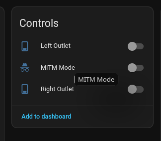

<p align="center">
  <picture>
    <!-- Black on transparent, so it is close to invisible on GitHub's dark
         theme without this. Absolute URLs because the brand assets live on
         the feature/ha-custom-component branch, not this one. -->
    <source
      media="(prefers-color-scheme: dark)"
      srcset="https://raw.githubusercontent.com/Proxy-alt/cync-lan/feature/ha-custom-component/custom_components/cync_lan/brand/dark_logo@2x.png">
    
  </picture>
</p>

>[!IMPORTANT]
> [DNS redirection REQUIRED](https://github.com/Proxy-alt/cync-lan/wiki/DNS)

>[!NOTE]
> This branch's package is now `cync-lan-mqtt` on PyPI (`pip install
> cync-lan-mqtt`), depending on the `cync-lan` core protocol library rather
> than bundling it - see the `core` branch. The `cync-lan` console script
> name and every environment variable are unchanged; only the underlying
> package/import names split (`cync_lan_mqtt` for this add-on's own
> `main.py`/`mqtt_client.py`/`exporter.py`, `cync_lan` for everything else).

# cync-lan-mqtt

Async HTTP/MQTT LAN controller for Cync/C by GE devices. **Local** only control
of **most** Cync devices via MQTT JSON payloads following the Home Assistant MQTT JSON schema. 
This project masquerades as the cloud server, allowing you to control your devices locally.

**This is a work in progress, and may not work for all devices.** 
See [known devices](docs/known_devices.md) for more information. Most battery powered devices are
still *not* supported since cync-lan can only listen to them, not write settings to them - the
standalone motion sensor and "Wireless Switch" accessories are the exception, both exposed as
`occupancy` binary sensors.

Forked from [cync-lan](https://github.com/iburistu/cync-lan) and 
[cync2mqtt](https://github.com/juanboro/cync2mqtt) - All credit to 
[iburistu](https://github.com/iburistu) and 
[juanboro](https://github.com/juanboro)

## There is a Home Assistant App for this project

Huge thanks to [@CodeNeedsCoffee](https://github.com/CodeNeedsCoffee) for the initial work on the App!

[](https://my.home-assistant.io/redirect/supervisor_add_addon_repository/?repository_url=https%3A%2F%2Fgithub.com%2FProxy-alt%2Fhass-addons)

The existing `python` branch will remain for users who prefer a non HASS App setup. However, docker is required and 
manual installation is no longer officially supported. The HASS app uses the `python` branch to build its image.

>[!WARNING]
> **DO NOT** contact GE / Savant for troubleshooting while using this project. Open an issue
> [here](https://github.com/Proxy-alt/cync-lan/issues) - this is a fork, so please don't send
> its bugs upstream to @baudneo.


>[!WARNING]
> It is **HIGHLY** recommended that you do **NOT** do any firmware upgrades to Cync devices after running cync-lan. 
> It is extremely (change 1 param in a constructor or config) easy for Savant to disable this method of local control.
> While new methods may restore functionality, I'd rather not go down that route.

## About this fork

This repository is itself a more recent fork, of [baudneo/cync-lan](https://github.com/baudneo/cync-lan)
(all of the above credit still applies - baudneo did the substantial rewrite
that this fork continues from). Upstream stopped receiving updates at
`0.0.6b16`; everything from `0.0.6b17` onward - see [CHANGELOG.md](./CHANGELOG.md)
for the full list - exists only here, including:

- Real motion-sensor support: the standalone motion-sensor accessory and the
  battery-powered "Wireless Switch" both now show up as `occupancy`
  binary_sensors, and switch/light models with a built-in motion/ambient
  sensor get a second entity for it.
- 54 previously-unrecognized device types added, plus corrected
  classification (light vs switch, dimmable vs not) for several existing
  wired-switch types that were wrong.
- A handful of real data-loss/crash bugs found via a new "Unsupported Device
  Debug Capture" tool: silently-dropped device status updates on certain
  packet variants, a TCP framing bug that discarded an entire read on a
  single misaligned byte, and a crash that could permanently kill MQTT.
- Fixed brightness state going stale on Sol-lamp devices, and a wrong
  effect ID that likely made the "fireworks" light-show effect silently
  fail.
- The protocol code was split out into a reusable
  [`cync-lan`](https://pypi.org/project/cync-lan/) library (the
  [`core`](https://github.com/Proxy-alt/cync-lan/tree/core) branch), so the
  add-on, the HA integration and anything else can share one implementation
  instead of vendoring copies that drift.
- Substantially expanded protocol documentation in
  [`docs/mesh_opcodes.md`](docs/mesh_opcodes.md), reverse-engineered from
  the decompiled Android app, with explicit confidence markers - most
  opcodes are **not** hardware-confirmed, and
  [`docs/hardware_verification.md`](docs/hardware_verification.md) tracks
  what still needs testing.
- Test suites and CI where there previously were none at all: this package
  had 2,456 lines, including a 1,900-line MQTT client, with nothing
  verifying any of it.

**A native Home Assistant integration also now exists** - not an add-on or
MQTT bridge, but a real `custom_component` you install through HACS, on the
`feature/ha-custom-component` branch. It doesn't exist upstream at all. See
[Choosing how to run this](#choosing-how-to-run-this) below, and
[`custom_components/cync_lan/README.md`](https://github.com/Proxy-alt/cync-lan/blob/feature/ha-custom-component/custom_components/cync_lan/README.md)/
[`custom_components/cync_lan/CHANGELOG.md`](https://github.com/Proxy-alt/cync-lan/blob/feature/ha-custom-component/custom_components/cync_lan/CHANGELOG.md)
for what it does specifically (light groups, Scenes/Schedules as real
entities, indicator-LED control, and pushing an existing HA automation onto
the Cync hub as a native schedule, among others) - it's versioned and
released separately from the Python package described in the rest of this
README.

## Repository layout

Three separately-versioned, separately-released artifacts share this one
repository, each on its own branch. **You are on `python`.**

| Artifact | Branch | What it is | Distributed via |
|---|---|---|---|
| `cync-lan` | [`core`](https://github.com/Proxy-alt/cync-lan/tree/core) | Core protocol library - sessions, packet codec, cloud auth, BLE | [PyPI](https://pypi.org/project/cync-lan/) |
| `cync-lan-mqtt` | **`python`** (here) | This: standalone Docker/MQTT daemon + HTTP device exporter | [PyPI](https://pypi.org/project/cync-lan-mqtt/) + [ghcr.io](https://github.com/Proxy-alt/cync-lan/pkgs/container/cync-lan-mqtt) image |
| `cync_lan` custom_component | [`feature/ha-custom-component`](https://github.com/Proxy-alt/cync-lan/tree/feature/ha-custom-component) | Native Home Assistant integration (no MQTT) | GitHub Release / HACS |

The three are versioned independently - bumping the core library does not
require bumping this add-on, or vice versa. [RELEASING.md](./RELEASING.md)
covers the details, including the rule that decides releases from
prereleases: a plain `X.Y.Z` version cuts a full release, `X.Y.ZbN` cuts a
prerelease, and anything else fails the build.

`docs/` is mirrored byte-for-byte across all three branches (canonical copy
on `core`), so any `docs/` link here resolves on any branch.

## Choosing how to run this

There are three different ways to get Cync devices talking to Home
Assistant through this project now, all requiring the same
[DNS redirection](https://github.com/Proxy-alt/cync-lan/wiki/DNS) but otherwise fairly different in setup:

| | Docker Compose (this README) | Home Assistant "App" ([hass-addons](https://github.com/Proxy-alt/hass-addons)) | HACS custom_component (`feature/ha-custom-component`) |
|---|---|---|---|
| Requires Docker | Yes, you run it | Yes, but HA Supervisor manages it | No |
| Requires an MQTT broker | Yes | Yes (HA's own Mosquitto add-on works) | No |
| Configuration | Environment variables / `docker-compose.yaml` | HA Supervisor's Options UI (`config.yaml` schema) | HA's own config flow (email/password + emailed code) - no YAML |
| Devices exposed as | MQTT-discovered entities | MQTT-discovered entities | Native HA entities (no MQTT involved) |
| Cloud-token encryption key | You set `CYNC_SECRET_KEY` yourself | You set the `secret_key` option yourself | Derived and set automatically - nothing to configure |
| Install method | `docker compose up` | Add the [hass-addons](https://github.com/Proxy-alt/hass-addons) repository, install the "CyncLAN Bridge" App | Add this repository to HACS as a custom repository (see below) |

If you're not sure which one you want: the HACS `custom_component` is the
newest and least Docker-dependent option, and it installs through HACS like
any other custom repository. If you'd rather stick with the well-established
Docker/MQTT path, the "App" is the least manual-setup version of that (no
docker-compose.yaml to write yourself), while this README's plain Docker
Compose instructions give you the most direct control.

## Prerequisites
- Docker
- A minimum of 1, non battery powered, Wi-Fi (*Direct Connect*) Cync / C by GE device to act as the TCP <-> BT bridge (always on)
- Cync account with devices added
- MQTT broker (I recommend EMQX)
- Export devices from the Cync cloud to a YAML file; first export requires account email, password and an OTP emailed to you
  - After configuring and running the container, navigate to http://127.0.0.1:23778 to export devices from the cloud 
- [DNS override/redirection](https://github.com/Proxy-alt/cync-lan/wiki/DNS) for `cm.gelighting.com`, `cm-sec.gelighting.com` or `cm-ge.xlink.cn` to a local host that will run `cync-lan`
- **Optional:** *[Firewall](#firewall) / routing rules to allow cync devices to talk to `cync-lan`* **(VLANs?)**

>[!NOTE]
> You still need to use your Cync account to add new devices as you acquire them.

---

## Installation

See the [installation](https://github.com/Proxy-alt/cync-lan/wiki/Installation) docs for more information.

Multi-arch images (`linux/amd64`, `linux/arm64`) are published to GitHub
Packages on every release:

```bash
docker pull ghcr.io/proxy-alt/cync-lan-mqtt:latest
```

`latest` only ever moves to a full release, never to a `bN` beta - pin a
version (`:0.2.1`) to upgrade deliberately. 32-bit ARM (`linux/arm/v7`) is
not published; see [docs/install.md](https://github.com/Proxy-alt/cync-lan/wiki/Installation) for why.

>[!IMPORTANT]
> After configuring and running the container (but before enabling DNS redirection), you must visit http://localhost:23778 in order to export your Cync 
> devices from the Cync cloud API. Your Cync account creds are set using an env var in the docker-compose.yaml file, 
> the web app will initiate OTP auth and export homes and each homes device list

### Re-routing / Overriding DNS
>[!WARNING] 
> After freshly redirecting DNS: Devices that are currently
> talking to Cync cloud will need to be power cycled before they make
> a DNS request and connect to the local `cync-lan` server.

There are detailed instructions for OPNSense (unbound / dnscrypt-proxy), Pi-hole, Ad-Guard Home and TP-Link Omada SDN. 
See [DNS docs](https://github.com/Proxy-alt/cync-lan/wiki/DNS) for more information.

---

## Proxy / MITM mode
As of 0.0.6, there is a proxy/MITM mode that can be enabled to capture the communication between a TCP connected device and the cloud server in real-time. 
This will allow for easier debugging and adding support for new devices and features. A button will be exposed for Cync devices that are connected to CyncLAN via TCP called 'MITM Mode':



### How it works
When you enable MITM mode for a device, the device is disconnected from the `nCync` server and upon reconnection, all of the binary data that the device sends or receives
is proxied to the actual Cync cloud server. The proxied data is logged in real-time to a file and optionally to the console using the `CYNC_MITM_{DEV|APP}_LOGGER` var.

While in MITM mode, the device is not able to be used to control Cync devices from Home Assistant, so it is recommended to have more than 1 TCP device connected to CyncLAN while using MITM mode.
Any device state will be updated in real-time while using MITM mode, we just cant write to the device while in MITM mode. This allows you to use the Cync app to control the device while in MITM mode and see the commands that the cloud server sends to the device.

Currently, only the Cync devices themselves are supported for MITM mode, work is ongoing to also allow proxying the Cync mobile app communication.
Th goal will be to always proxy the app, but only log the proxied data if configured to do so.

### Example log output
The idea is to mimic the socat hex dump format for easy readability and parsing. The data is logged in the format of:
```
2026/05/13 02:18:56.260 [MITM dev:10.0.35.25] < from_cloud length=5 from=99204 to=99208
 d8 00 00 00 00                                    .....
--
2026/05/13 02:19:16.674 [MITM dev:10.0.35.25] > to_cloud length=5 from=165381 to=165385
 d3 00 00 00 00                                    .....
--
2026/05/13 02:19:16.766 [MITM dev:10.0.35.25] < from_cloud length=5 from=99209 to=99213
 d8 00 00 00 00                                    .....
--
2026/05/13 02:19:37.181 [MITM dev:10.0.35.25] > to_cloud length=5 from=165386 to=165390
 d3 00 00 00 00                                    .....
--
2026/05/13 02:19:37.262 [MITM dev:10.0.35.25] < from_cloud length=5 from=99214 to=99218
 d8 00 00 00 00                                    .....
--
2026/05/13 02:19:53.898 [MITM dev:10.0.35.25] > to_cloud length=63 from=165391 to=165453
 43 00 00 00 3a 46 3d 29 20 01 01 06 c7 90 2e 32   C...:F=) ......2
 30 32 36 30 35 31 33 3a 30 32 32 30 3a 2d 33 39   0260513:0220:-39
 2c 30 30 31 37 37 2c 30 30 32 2c 30 30 30 30 30   ,00177,002,00000
 2c 30 30 31 34 39 2c 30 30 30 30 39 2c 7f fe      ,00149,00009,..
--
2026/05/13 02:19:53.981 [MITM dev:10.0.35.25] < from_cloud length=8 from=99219 to=99226
 48 00 00 00 03 01 01 00                           H.......
--
```

### Log files
The log files are stored by default in the config dir under `mitm_logs` with the filename format of `{(dev|app)}_{device_(ip|id)}_{date:Ymd}.log`. 
The log files are rotated at local midnight and are not deleted by the app at any point, so it is up to the user to manage the log files.

### Workflow
- Enable MITM mode for a device, wait for it to reconnect, it is now being proxied and logged
- Disable Bluetooth on your mobile device to force the Cync app to talk to the device via the cloud and thus allowing you to see the commands that the cloud server is sending to the device in real-time in the MITM log output
- Use the Cync app to control the device, observe the current time and note it alongside what command was sent (hvac on, hvac set heat/cool/temp change, dynamic light segment RGB, etc.)
- Allow a 10-15 second window to pass between sending commands to allow easier parsing of the raw data
- Open an issue with the MITM log output and what commands with timestamps, this should allow for adding support for new devices and features without needing to have the device in hand for testing

---

## Tips
See [Tips](https://github.com/Proxy-alt/cync-lan/wiki/Tips) for more information on how to get the most out of this project.

## Cync Group/Room support
Currently, the only way to interact with cync groups is to target a physical mains powered light switch that is a part of the Cync group/room with the on/off, kelvin or RGB command.
Cync switches are represented as a light in Home Assistant, so you can target the switch with light commands. The Cync group/room that the switch is a part of will change in unison, 
just like they do in the Cync app when you control a group/room, or a physical button press.

This assumes the switch is configured to control Cync devices logically rather than physical switching of the circuit (hasn't been tested with non logical setup).

Also, let me set some expectations:
1. HASS based light groups will always have a delay/popcorn on state changes between each other (set a HASS group of Cync lights green, they don't all change to green at the same time)
2. Custom light scenes/shows; from what I have seen it sends a large stream of binary data to the device (presumably RGB, fade/transition times, etc.) then the device executes the show/scene on a loop based on that data. This will be on the roadmap at some point once things get to a basic stable build of 0.1.0+.

---

## Config file
See the example [config file](./cync_mesh_example.yaml)

### Export config from Cync cloud API
By default, the export webserver is started when cync-lan is. Navigate to http://localhost:23778 to access the export web app.

---

## Env Vars
For the `yes` / `no` value, the user input is cast to a lower case string stripped of spaces:
- Yes answers: "true", "t", "yes", "y", "1", 1, "on", "o"
- No is interpreted as anything other than the yes answers

| Variable                     | Description                                                                                                    | Default                               | Type |
|------------------------------|----------------------------------------------------------------------------------------------------------------|---------------------------------------|------|
| `CYNC_CLOUD_IP`              | IP address of the Cync cloud server (for proxy/MITM mode)                                                      | `34.73.130.191`                       | str  |
| `CYNC_ENABLE_EXPORTER`       | Start the local device export web app                                                                          | `yes`                                 | str  |
| `CYNC_ACCOUNT_USERNAME`      | Cync account username (email) *Required* for the export web app                                                |                                       | str  |
| `CYNC_ACCOUNT_PASSWORD`      | Cync account password *Required* for the export web app                                                        |                                       | str  |
| `CYNC_SECRET_KEY`            | *Required.* Random alphanumeric string used to encrypt the cached cloud auth token at rest (Fernet/PBKDF2HMAC). Pick your own value and keep it stable - changing it invalidates the cache and forces a re-login. | | str |
| `CYNC_OVERWRITE_CONFIG_FILE` | On export, overwrite `cync_mesh.yaml` or use a numbered system: `*_1.yaml`, `*_2.yaml`, etc.                   | `yes`                                 | str  |
| `CYNC_MQTT_HOST`             | Host of MQTT broker                                                                                            | `homeassistant.local`                 | str  |
| `CYNC_MQTT_PORT`             | Port of MQTT broker                                                                                            | `1883`                                | int  |
| `CYNC_MQTT_USER`             | Username for MQTT broker                                                                                       |                                       | str  |
| `CYNC_MQTT_PASS`             | Password for MQTT broker                                                                                       |                                       | str  |
| `CYNC_MQTT_CONN_DELAY`       | Delay between MQTT re-connections (seconds)                                                                    | `10`                                  | int  |
| `CYNC_MQTT_DEBUG`            | Override MQTT debug logs (set to no for less debug level log spam)                                             | `yes`                                 | str  |
| `CYNC_APP_MITM_LOGGING`      | Cync mobile apps are always proxied, this controls if the proxied data is logged or not                        | `no`                                  | str  |
| `CYNC_DEBUG`                 | Enable debug logging                                                                                           | `no`                                  | str  |
| `CYNC_RAW_DEBUG`             | Enable raw binary message debug logging (non-MITM, so strictly between dev and CyncLAN)                        | `no`                                  | str  |
| `CYNC_MITM_DEV_LOGGER`       | Enable MITM console logging for Cync Devices (enabling this will also output to the console)                   | `no`                                  | str  |
| `CYNC_MITM_APP_LOGGER`       | Enable MITM console logging for mobile APPS (enabling this will also output to the console)                    | `no`                                  | str  |
| `CYNC_MITM_ENTITIES`         | Show a per-device "MITM Mode" switch entity in HASS. Off by default since 0.0.6b22 - MITM mode itself still works via the button/service either way, this only controls whether a dedicated entity clutters your dashboard | `no` | str |
| `CYNC_UNSUPPORTED_RAW_DEBUG` | Log raw packets from never-seen or unsupported device types to a dedicated `unsupported_devices.log`, independent of `CYNC_RAW_DEBUG` - safe to leave on for an extended capture, useful when reporting a new device type | `no` | str |
| `CYNC_EXPERIMENTAL_LOG_PATH` | Override where every `experimental_*` command/service invocation gets recorded - always-on, no flag needed. Attach `experimental_features.log` (default location alongside your other cync-lan files) when reporting a bug about any experimental feature | `{CYNC_CONFIG_DIR}/experimental_features.log` | str |
| `CYNC_DEVICE_CERT`           | Path to cert file                                                                                              | `certs/server.pem`                    | str  |
| `CYNC_DEVICE_KEY`            | Path to key file                                                                                               | `certs/server.key`                    | str  |
| `CYNC_SRV_HOST`              | Interface to listen on                                                                                         | `0.0.0.0`                             | str  |
| `CYNC_PORT`                  | Port to listen for Cync devices (Do NOT change, unless you know what you are doing)                            | `23779`                               | int  |
| `CYNC_EXPORT_HOST`           | Host for export web app                                                                                        | `{CYNC_SRV_HOST}`                     | str  |
| `CYNC_EXPORT_PORT`           | Port for export web app                                                                                        | `23778`                               | int  |
| `CYNC_TOPIC`                 | MQTT topic                                                                                                     | `cync_lan`                            | str  |
| `CYNC_HASS_TOPIC`            | Home Assistant topic                                                                                           | `homeassistant`                       | str  |
| `CYNC_HASS_STATUS_TOPIC`     | HASS status topic for birth / will                                                                             | `status`                              | str  |
| `CYNC_HASS_BIRTH_MSG`        | HASS birth message                                                                                             | `online`                              | str  |
| `CYNC_HASS_WILL_MSG`         | HASS will message                                                                                              | `offline`                             | str  |
| `CYNC_CMD_BROADCASTS`        | Number of WiFi devices to send state *change* commands to (2+ offers noticeable command response improvements) | `2`                                   | int  |
| `CYNC_MAX_TCP_CONN`          | Maximum WiFi devices allowed to connect at a time (keep down log spam, unneccesary load)  more != better       | `8`                                   | int  |
| `CYNC_TCP_WHITELIST`         | Comma separated string of allowed IPs (keep down log spam, unneccesary load, restrict to 'always-on' devices)  | Allow ALL IPs                         | str  |
| `CYNC_BASE_DIR`              | Base directory for **ALL** files.                                                                              | `/root/cync-lan`                      | str  |
| `CYNC_CFGAPPEND_DIR`         | Directory for persistent files (config, uuid, etc.) This is **appended** to `CYNC_BASE_DIR`                    | `/config`                             | str  |
| `CYNC_STATIC_DIR`            | Absolute path to where the index.html and css/js dirs/files are stored                                         | `{CYNC_BASE_DIR}/www`                 | str  |
| `CYNC_CONFIG_DIR`            | Absolute path to where the persistent files are stored (cync_mesh.yaml, uuid.txt and .cloud_auth.yaml)         | `{CYNC_BASE_DIR}{CYNC_CFGAPPEND_DIR}` | str  |

---

## Controlling devices
Devices are controlled by JSON MQTT messages. This was designed to be used 
with Home Assistant, but you can use any MQTT client to send messages 
to the MQTT broker.

**Please see [Home Assistant MQTT documentation](https://www.home-assistant.io/integrations/light.mqtt/#json-schema) 
for more information on JSON payloads.** This repo will try to stay up to
date with the latest Home Assistant MQTT JSON schema.

### Home Assistant
Cync-LAN uses the MQTT discovery mechanism in Home Assistant to 
automatically add devices. You can control the Home Assistant MQTT 
topic via the environment variable `CYNC_HASS_TOPIC` (default: `homeassistant`).

---

## Legacy `socat` based debugging
You can use `socat` to inspect (MITM) the traffic of the device communicating with the 
cloud server in real-time yourself by running:

```bash
# make sure to create the self-signed certs first using the included script (they will be located in ./certs/ dir)
# Older firmware devices
sudo socat -d -d -lf /dev/stdout -x -v 2> dump.txt ssl-l:23779,reuseaddr,fork,cert=certs/server.pem,verify=0 openssl:34.73.130.191:23779,verify=0
# Newer firmware devices (Notice the last IP change)
sudo socat -d -d -lf /dev/stdout -x -v 2> dump.txt ssl-l:23779,reuseaddr,fork,cert=certs/server.pem,verify=0 openssl:35.196.85.236:23779,verify=0
```
In `dump.txt` you will see the back-and-forth communication between the device and the cloud server.
`>` is device to server, `<` is server to device.

### Best `socat` based debugging practices
- Turn BT off on mobile devices to force TCP comms between app and device
- spin up vm/lxc so you have 2 `socat` hosts available
- using unbound and its `views` feature to selectively redirect devices to your MITM `socat` machine is a great way to reduce noise in the logs and only capture the traffic of the device you want to add support for
  - allows for only redirecting the device and mobile app to different machines hosting `socat`; see what the mobile app sends and then what the cloud sends to the device
  - the goal is to only have 1 device talking to 1 `socat` instance, so you can easily correlate the logs to the device and not have to sift through a ton of noise from other devices

## Firewall
Once the devices are local, they must be able to initiate a connection to 
the `cync-lan` server. If you block them from the internet, don't forget to 
allow them to connect to the `cync-lan` server (VLANs?).

## OPNsense Example
Please see the [example](https://github.com/Proxy-alt/cync-lan/wiki/Troubleshooting#opnsense-firewall-example)
in the troubleshooting docs.

## Power cycle devices after DNS re-route
Devices make a DNS query on first startup (or after a network loss,
like AP reboot) - you need to power cycle all devices that are currently 
connected to the Cync cloud servers before they request a new DNS record 
and will connect to the local `cync-lan` server.

## Experimental: BLE provisioning of brand-new devices
`cync-lan-ble-provision` (install with `pip install cync_lan[ble]`) is an **EXPERIMENTAL, untested
against real hardware** command-line tool for pairing a brand-new/factory-reset Cync device onto a
mesh over BLE directly - unrelated to the TCP relay server above, and a different transport
entirely. See [docs/ble_provisioning_protocol.md](docs/ble_provisioning_protocol.md) for the full
protocol research this implements. Usage:

```bash
cync-lan-ble-provision scan
cync-lan-ble-provision provision <ble-address> <mesh-name> <mesh-password>
```

Please report success or failure (with the exact error/traceback either way) if you try this
against real hardware.

## Troubleshooting
If you are having issues, please see the 
[Troubleshooting docs](https://github.com/Proxy-alt/cync-lan/wiki/Troubleshooting) for more information.

## Credits

This project is the current link in a chain of earlier work, and none of it
would exist without the people below.

- **[iburistu](https://github.com/iburistu)** -
  [cync-lan](https://github.com/iburistu/cync-lan), the original. The first
  public demonstration that Cync devices could be controlled locally by
  impersonating the cloud server. MIT, © 2022 Zachary Linkletter.
- **[juanboro](https://github.com/juanboro)** -
  [cync2mqtt](https://github.com/juanboro/cync2mqtt), the original MQTT
  bridge and cloud-export approach that this add-on's whole shape descends
  from. Apache-2.0. Little of that code survives verbatim at this point, but
  the attribution stays. Long live OSS.
- **[baudneo](https://github.com/baudneo)** -
  [baudneo/cync-lan](https://github.com/baudneo/cync-lan), the substantial
  async rewrite this fork continues from, and the origin of most of the
  protocol knowledge here. Upstream stopped at `0.0.6b16`; everything from
  `0.0.6b17` onward exists only in this fork.
- **[@CodeNeedsCoffee](https://github.com/CodeNeedsCoffee)** - initial work
  on the Home Assistant App.

Full license texts for all of the above are reproduced in
[LICENSE-3RD-PARTY](./LICENSE-3RD-PARTY).

## License

MIT, same as the original - see [LICENSE](./LICENSE).